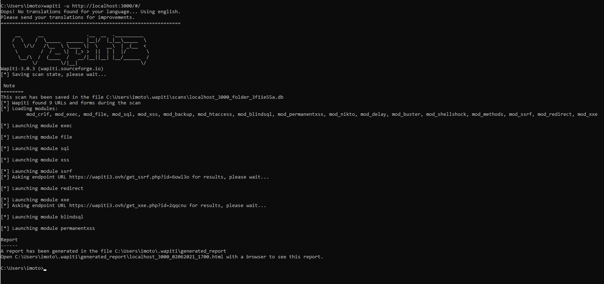
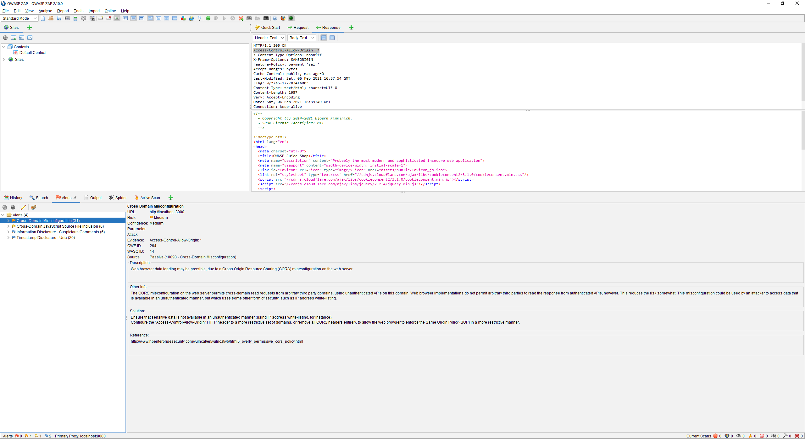

# Vulnerable Web App Penetration Testing

### Repository consists of 6 simple python scripts which task is to find vulnerabilities in web apps.

Notice that all of the scripts had been run on locally hosted web application which can be found [here](https://github.com/bkimminich/juice-shop) and was created for educational purposes.

### How to run:

Simply run the main.py by use of python:  
``python main.py``  

Available actions:
- 1 - 01_web_pen
- 2 - 02_req
- 3 - 03_web_req
- 4 - 04_authentication
- 5 - sql_inject
- 6 - xss detection
- 0 - exit

Then select the script to use (from 1-6)
To exit ``main.py``  simply chose 0

#### Screenshot of all python scripts outputs:

#### Findings
- Running script 01 informed us about existing request types to which is the application listening:
GET,POST,PUT,DELETE,TRACE returned code 200 so we might interfere with database without using credentials

- Running of script 02 did not reveal anything noteworthy.

- Script 03 hints at possible vulnerabilities to XSS (due to lack of X-XSS-Protection) and MITM attacks (due to lack of the HSTS header). It also revealed the lack of Content-Security-Policy.

- The fourth script doesn't seem to be compatible with the Web App we chose.

## Static code analysis

We used insider to analyze the source code of OWASP Juice Shop.

Command:
> insider -jobs (number of threads) -tech javascript -target (path to project)

## Vulnerability Scanning Tool

We used wapiti to find vulnerabilities within OWASP Juice Shop.

Command:
> wapiti -u http://localhost:3000/#/ 

## ZAP

