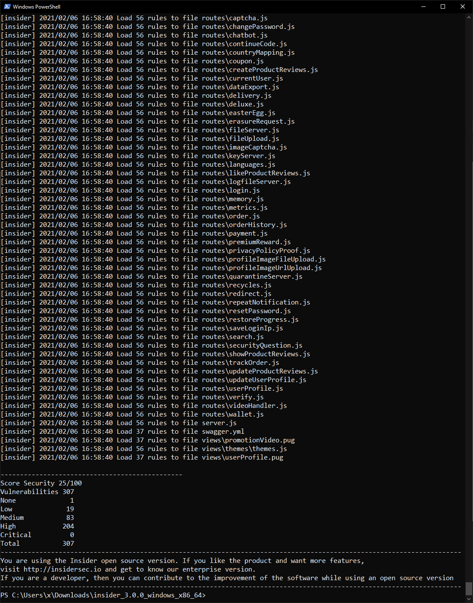

# Vulnerable Web App Penetration Testing

### Repository consists of 4 simple python scripts which task is to find vulnerabilities in web apps.

Notice that all of the scripts had been run on locally hosted web application which can be found [here](https://github.com/bkimminich/juice-shop) and was created for educational purposes.

#### Screenshot of all python scripts outputs:

#### Findings
- Running script 01 informed us about existing request types to which is the application listening:
GET,POST,PUT,DELETE,TRACE returned code 200 so we might interfere with database without using credentials

- Running of script 02 did not reveal anything noteworthy.

- Script 03 hints at possible vulnerabilities to XSS (due to lack of X-XSS-Protection) and MITM attacks (due to lack of the HSTS header). It also revealed the lack of Content-Security-Policy.

- The fourth script doesn't seem to be compatible with the Web App we chose.

## Static code analysis

We used insider to analyze the source code of OWASP Juice Shop.

